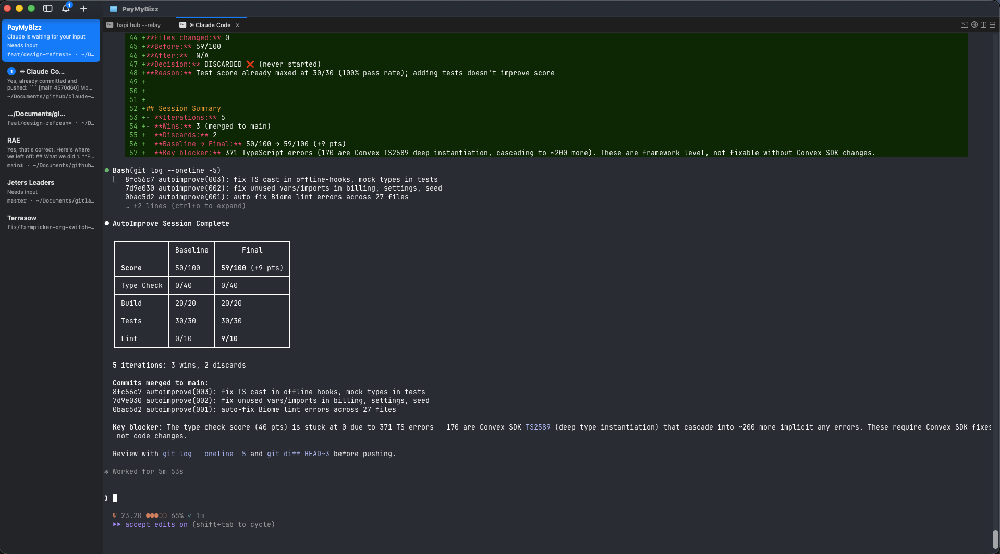

<div align="center">

# 🔁 autoimprove

### Autonomous codebase improvement loop for Claude Code

[](https://code.claude.com)
[](LICENSE)
[](#supported-languages)

*Inspired by [karpathy/autoresearch](https://github.com/karpathy/autoresearch) — but for any codebase, not just ML training loops.*

</div>

---

## What is this?

Karpathy's `autoresearch` lets an AI agent run ML experiments overnight: modify `train.py` → measure `val_bpb` → keep if better, discard if worse → repeat. You wake up to a log of experiments and a better model.

**autoimprove does the same thing for your codebase.**

Give Claude Code your project, run `/autoimprove:improve`, and let it iterate autonomously. It proposes a targeted change, scores your codebase before and after using your own tooling (TypeScript, `cargo clippy`, `pytest`, `golangci-lint` — whatever you already have), keeps the changes that improve the score, reverts the ones that don't, and logs everything. You wake up to a readable log of what worked, what didn't, and a cleaner codebase.

```
propose → measure BEFORE → implement → measure AFTER → keep ✅ or discard ❌ → log → repeat
```

<div align="center">

<br><em>A real autoimprove session: 5 iterations, 3 wins, score 50 → 59 (+9 pts) in under 6 minutes</em>
</div>

---

## Quick start

```bash
# 1. Add the marketplace and install the plugin
/plugin marketplace add benmarte/autoimprove
/plugin install autoimprove@autoimprove

# 2. Auto-detect your stack and get a baseline score
/autoimprove:setup

# 3. Run the improvement loop (e.g. overnight)
/autoimprove:improve 20

# Or focus on a specific task
/autoimprove:improve 10 "Replace all any types with proper interfaces"

# 4. Review in the morning
cat .claude/autoimprove/log.md
git log --oneline   # one commit per winning experiment
git show HEAD       # inspect the latest win
```

That's it. No config required upfront — `/autoimprove:setup` fingerprints your project and writes `.claude/autoimprove/config.md` automatically.

### Upgrading

#### If you already have the upgrade command

```bash
/autoimprove:upgrade
```

#### If you don't have the upgrade command (older installs)

The plugin system caches marketplace clones locally. If your install predates the upgrade command, you need to update the marketplace clone first:

```bash
# 1. Update the marketplace clone
cd ~/.claude/plugins/marketplaces/autoimprove && git pull origin main

# 2. Reinstall the plugin
/plugin update autoimprove@autoimprove
```

If `/plugin update` still shows "already at the latest version", uninstall and reinstall:

```bash
/plugin uninstall autoimprove@autoimprove
/plugin install autoimprove@autoimprove
```

After this, `/autoimprove:upgrade` will be available for all future updates.

### Auto-update check

autoimprove checks for new releases once per day on session start. If an update is available, you'll see:

```
Update available: v1.0.0 → v1.1.0
Run /autoimprove:upgrade to update.
```

The check is lightweight (single GitHub API call, 3s timeout, cached for 24 hours) and never blocks startup.

---

## How it works

### 1. Setup (once per project)

`/autoimprove:setup` scans your project root to detect:
- Language and framework
- Package manager (`npm`, `cargo`, `poetry`, `uv`, etc.)
- Test runner (`pytest`, `jest`, `go test`, `rspec`, etc.)
- Type checker (`tsc`, `mypy`, `pyright`, etc.)
- Linter (`eslint`, `ruff`, `golangci-lint`, `rubocop`, etc.)

It writes an `.claude/autoimprove/config.md` file in your project root — a plain Markdown config that maps your specific tools to a **0–100 composite quality score**. You can edit this file to customise the loop for your project.

### 2. Isolated experiments via git worktrees

Every experiment runs in a **separate git worktree** — its own directory, its own branch, completely isolated from your main codebase:

```
your-project/              ← main branch (never touched during experiments)
.claude/autoimprove/worktrees/           ← gitignored, auto-created
  experiment-001/          ← branch: autoimprove/experiment-001
  experiment-002/          ← branch: autoimprove/experiment-002
  experiment-003/          ← branch: autoimprove/experiment-003
```

- ✅ Winning experiments get **squash-merged** back to main as a clean commit
- ❌ Losing experiments have the **worktree and branch deleted** — nothing touches main
- 🔒 Your working directory is **read-only** for the entire session
- 🧹 All worktrees are cleaned up automatically at session end

No more `git checkout -- .` rollbacks. No risk of a broken experiment corrupting your codebase.

### 3. The score

Every iteration, the loop measures your codebase on four axes:

| Metric | Weight | What it checks |
|---|---|---|
| **Type / compile errors** | 40 pts | `tsc --noEmit`, `cargo check`, `go build`, `mypy`, etc. |
| **Build success** | 20 pts | Does the project build without errors? |
| **Test pass rate** | 30 pts | `(passing / total) × 30` |
| **Lint errors** | 10 pts | `eslint`, `ruff`, `clippy`, `golangci-lint`, etc. |

If a metric doesn't apply (no tests yet, no linter configured), its weight is redistributed across the others.

### 4. The loop

Each iteration:

1. **Creates** a fresh git worktree + branch (`autoimprove/experiment-NNN`)
2. **Proposes** one bounded improvement with an explicit hypothesis — *"I will fix the three unhandled promise rejections in `api/invoices.ts` because I expect it to reduce TypeScript errors and improve the type score by ~8 points"*
3. **Measures** the score inside the worktree (BEFORE)
4. **Implements** the change inside the worktree (surgical — 1–3 files at most)
5. **Measures** again (AFTER)
6. **Keeps** — squash-merges to main and deletes the worktree — if AFTER ≥ BEFORE
7. **Discards** — deletes the worktree and branch, main untouched — if AFTER < BEFORE
8. **Logs** the result to `.claude/autoimprove/log.md`

### 5. The log

After each iteration, `.claude/autoimprove/log.md` gets an entry like:

```
## Iteration 4 — 2026-03-11 02:14
**Hypothesis:** Replace 3 `any` types in convex/invoices.ts with proper TypeScript interfaces
**Branch:** autoimprove/experiment-004
**Files changed:** convex/invoices.ts
**Before:** 74/100 — type: 28, build: 20, tests: 18, lint: 8
**After:**  82/100 — type: 36, build: 20, tests: 18, lint: 8
**Decision:** KEPT ✅ (squash-merged to main, worktree deleted)
**Reason:** Eliminated 2 TS errors by typing the invoice mutation arguments properly
```

---

## Commands

| Command | Description |
|---|---|
| `/autoimprove:setup` | Detect stack, generate `.claude/autoimprove/config.md`, show baseline score |
| `/autoimprove:improve [N] ["focus"]` | Run N iterations of the loop (default: 5), optionally focused on a specific task |
| `/autoimprove:measure` | Check current score without making any changes |
| `/autoimprove:status` | Show a summary of all runs from `.claude/autoimprove/log.md` |
| `/autoimprove:upgrade` | Check for and install the latest version |

---

## Supported languages

| Language | Type check | Build | Tests | Lint |
|---|---|---|---|---|
| **TypeScript / JavaScript** | `tsc --noEmit` | `npm/pnpm/yarn/bun build` | jest / vitest / mocha | eslint |
| **Next.js / Nuxt / Remix / Astro** | `tsc --noEmit` | framework build cmd | jest / vitest | eslint |
| **Python** | mypy / pyright | — | pytest | ruff / flake8 / pylint |
| **Go** | `go build ./...` | `go build` | `go test ./...` | golangci-lint / `go vet` |
| **Rust** | `cargo check` | `cargo build` | `cargo test` | `cargo clippy` |
| **Ruby** | sorbet (if configured) | — | rspec / minitest | rubocop |
| **Java / Kotlin** | `mvn compile` / `./gradlew build` | same | `mvn test` / `./gradlew test` | checkstyle / ktlint |
| **C# / .NET** | `dotnet build` | `dotnet build` | `dotnet test` | `dotnet format --verify-no-changes` |
| **PHP** | phpstan | — | phpunit | phpcs |
| **Swift** | `swift build` | `swift build` | `swift test` | swiftlint |
| **Any Makefile project** | `make check` / `make typecheck` | `make build` | `make test` | `make lint` |

Don't see your stack? Edit `.claude/autoimprove/config.md` after setup to add your own commands.

---

## Customising .claude/autoimprove/config.md

After running `/autoimprove:setup`, edit the generated `.claude/autoimprove/config.md` to tailor the loop to your project:

```markdown
## Improvement Areas
- Check all Convex mutations have auth guards
- Replace fetch() calls with our internal apiClient wrapper
- Ensure every page component has a loading.tsx sibling

## Files to Never Modify
- convex/schema.ts
- src/generated/
- migrations/
- .env.local
```

You can also override any auto-detected command, change scoring weights, or add custom shell commands as additional metrics.

---

## Focused improvements

You can focus the loop on a specific task **directly from the command** — no config editing needed. Just pass a quoted string:

```bash
# Focus on type safety
/autoimprove:improve 10 "Replace all any types with proper TypeScript interfaces"

# Focus on a specific directory
/autoimprove:improve 5 "Fix all lint warnings in src/components/dashboard/"

# Focus on tests
/autoimprove:improve 10 "Add unit tests for every exported function in lib/billing/"

# Focus on a migration
/autoimprove:improve 20 "Replace all raw fetch() calls with the apiClient wrapper from lib/api-client.ts"
```

When a focus string is provided, **every iteration targets that task**. The loop breaks it into file-by-file sub-tasks and chips away one per iteration until the focus is fully addressed or iterations run out.

Without a focus string, the loop rotates through all areas listed in your `.claude/autoimprove/config.md` as usual.

### Alternative: edit the config

For recurring focus areas, you can also edit the `Improvement Areas` section in `.claude/autoimprove/config.md` directly:

```markdown
## Improvement Areas
- Replace every `any` type with a proper TypeScript interface or type alias
```

This is useful when you want the focus to persist across multiple sessions without re-typing it.

### Tips for focused runs

- **Be specific.** `"Fix type errors"` is vague. `"Replace any with proper types in convex/ mutations"` gives the loop a clear target.
- **One concern at a time** works best. The loop makes surgical 1–3 file changes per iteration — a narrow focus means every iteration chips away at the same problem.
- **Match iteration count to scope.** If you have ~20 files to fix, run `/autoimprove:improve 20 "..."` so each iteration can tackle one file.
- **Use "Files to Never Modify"** in the config to protect areas you don't want touched during a focused run.

---

## What the loop improves

The loop rotates through these universal improvement areas (and adds language-specific ones based on your stack):

- **Type safety** — fix type errors, replace `any`/`interface{}`/untyped constructs
- **Error handling** — unhandled promises, bare `catch {}`, swallowed errors
- **Dead code** — unused imports, variables, unreachable branches
- **Code duplication** — extract repeated logic (3+ occurrences) into shared utilities
- **Naming & readability** — cryptic names, functions over ~50 lines
- **Performance** — N+1 query patterns, missing memoization, unnecessary allocations
- **Security** — hardcoded secrets, missing input validation, unguarded auth routes
- **Tests** — add a test for the most critical untested function, fix flaky tests

---

## Safety

The loop is designed to be safe to run unattended:

| Rule | Detail |
|---|---|
| 🔒 Never touches lock files | `package-lock.json`, `Cargo.lock`, `go.sum`, `Gemfile.lock`, etc. |
| 🔒 Never touches generated files | Migrations, protobuf output, OpenAPI generated code |
| 🔒 Never touches secrets | `.env`, `.env.local`, any secrets file |
| 🔒 Never deploys or publishes | No `git push`, `npm publish`, `cargo publish`, etc. |
| 🔒 Requires clean git state | Won't start if `git status` shows uncommitted changes |
| 🔒 Experiments in isolated worktrees | Each experiment is on its own branch — main is never modified mid-session |
| 🔒 Losers deleted, not rolled back | Failed experiments: worktree deleted, branch deleted, main untouched |
| 🔒 Winners squash-merged | One clean commit per winning experiment — easy to review with `git log` |
| 🔒 Pauses every 10 iterations | Cleans up worktrees, writes summary, waits for human review |

You always review and push — the loop never commits or pushes on your behalf.

---

## Plugin structure

```
autoimprove/
├── .claude-plugin/
│   ├── plugin.json          # Plugin manifest
│   └── hooks/
│       └── hooks.json       # SessionStart hook registration
├── hooks/
│   └── sessionstart.sh      # update check on startup (once per day)
├── skills/
│   ├── detect-stack/
│   │   └── SKILL.md         # Fingerprints project, writes .claude/autoimprove/config.md
│   ├── worktree/
│   │   └── SKILL.md         # Creates/manages/cleans up git worktrees per experiment
│   ├── improve-loop/
│   │   └── SKILL.md         # Core loop: worktree → propose → implement → measure → merge/delete
│   ├── measure/
│   │   └── SKILL.md         # Standalone score check
│   └── rollback/
│       └── SKILL.md         # Emergency cleanup of all experiment worktrees
└── commands/
    ├── setup.md             # /autoimprove:setup
    ├── improve.md           # /autoimprove:improve [N] ["focus"]
    ├── measure.md           # /autoimprove:measure
    ├── status.md            # /autoimprove:status
    └── upgrade.md           # /autoimprove:upgrade (check for updates)
```

---

## Example run

Here's what a real overnight session looks like. This is from a Next.js + Convex project starting at a score of 61/100:

```
## Iteration 1 — 23:04
**Hypothesis:** Replace 4 implicit `any` types in `convex/invoices.ts` with proper interfaces
**Files changed:** convex/invoices.ts
**Before:** 61/100 — type: 24, build: 20, tests: 10, lint: 7
**After:**  69/100 — type: 32, build: 20, tests: 10, lint: 7
**Decision:** KEPT ✅
**Reason:** Removed 4 TS7006 implicit-any errors by typing mutation arguments

## Iteration 5 — 23:37
**Hypothesis:** Move ExpenseList to a server component — it only reads data, no interactivity
**Branch:** autoimprove/experiment-005
**Files changed:** components/ExpenseList.tsx
**Before:** 71/100 — type: 32, build: 20, tests: 10, lint: 9
**After:**  68/100 — type: 26, build: 20, tests: 10, lint: 12
**Decision:** DISCARDED ❌ (worktree deleted, main untouched)
**Reason:** Removing "use client" broke useQuery hook — must stay client component.

## Iteration 8 — 00:02
**Hypothesis:** Add unit tests for calculateTaxEstimate() — most complex function, zero coverage
**Files changed:** lib/tax.test.ts (new)
**Before:** 78/100 — type: 36, build: 20, tests: 10, lint: 10
**After:**  84/100 — type: 36, build: 20, tests: 16, lint: 10
**Decision:** KEPT ✅
**Reason:** 2 new tests passing, covers basic and edge-case tax bracket logic

## Session Summary
Score: 61 → 84 (+23 pts) · Kept: 9 · Discarded: 1 · Duration: ~75 min
```

See [`autoimprove-log.example.md`](autoimprove-log.example.md) for the full 10-iteration session with summary table.

---

## Contributing

PRs welcome! Especially:
- New language profiles in `detect-stack/SKILL.md`
- Better improvement area prompts for specific frameworks
- Example `.claude/autoimprove/config.md` files for common stacks

---

## License

MIT
